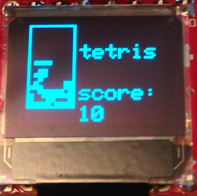
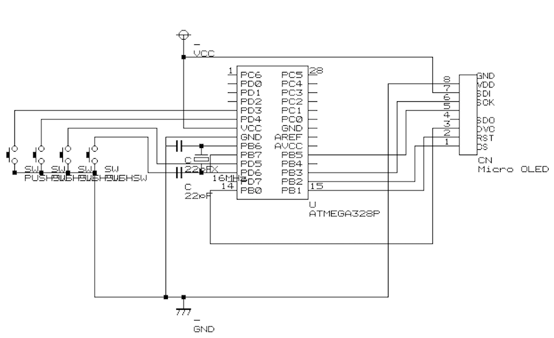

# OLED tetris game
OLED tetris game by arduino nano

In schematic picture,using atmega328,but same wiring make it possible to move this game by arduino nano.

OLED:  https://www.sparkfun.com/products/13003

